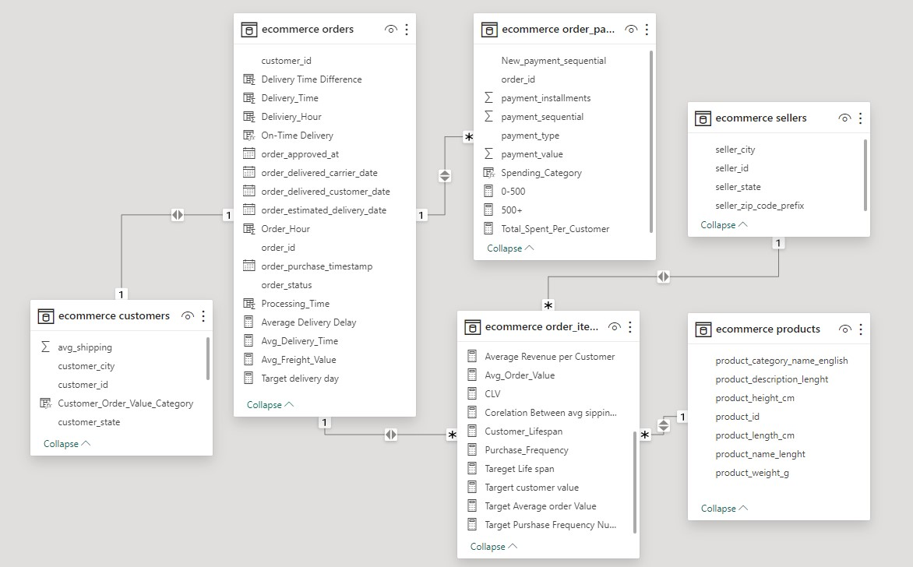

# **E-commerce Data Analysis and Dashboard** 📊

## **Table of Contents** 📑
1. [Overview](#overview)  
2. [Objective](#objective)  
3. [Data Source](#data-source)  
4. [Data Preparation](#data-preparation)  
   - [Step 1: Data Cleaning and Transformation in Excel](#step-1-data-cleaning-and-transformation-in-excel)  
   - [Step 2: Transition to SQL for Large-Scale Data Handling](#step-2-transition-to-sql-for-large-scale-data-handling)  
   - [Step 3: Optimizing Data Import with CSV Lint](#step-3-optimizing-data-import-with-csv-lint)  
5. [Dashboard Overview](#dashboard-overview)  
6. [Key Insights](#key-insights)  
7. [Technical Challenges and Solutions](#technical-challenges-and-solutions)  
8. [Tools Used](#tools-used)  
9. [Conclusion](#conclusion)  
10. [Access](#access)  

## **Overview** 💡
This project involves a comprehensive analysis of a Brazilian e-commerce dataset (2017–2018), leveraging tools like Excel, SQL, and Power BI to derive actionable insights into sales performance, customer behavior, shipping logistics, and seller activity. The project culminates in an interactive Power BI dashboard designed to support business decisions with key metrics and trends.

## **Objective** 🎯
The primary goal of this project was to perform a comprehensive analysis of the Brazilian e-commerce dataset from 2017–2018, focusing on several key aspects of the business:

1. **Analyze Sales Trends**: Identify patterns in sales performance over time, including seasonal fluctuations, top-selling categories, and revenue distribution across different regions.
2. **Evaluate Shipping Efficiency**: Assess the performance of the logistics and shipping processes, analyzing factors like shipping costs, delivery times, and regional differences.
3. **Examine Order Lifecycle**: Track the entire journey of an order, from purchase to delivery, and identify areas where delays occur or performance could be improved.
4. **Provide Insights into Customer Behavior**: Segment customers based on their purchasing patterns, frequency, and lifetime value to understand customer retention and acquisition strategies.
5. **Assess Seller Contributions**: Analyze seller performance, focusing on sales volume, product categories, and geographic distribution to identify top-performing sellers and opportunities for improvement.


## **Data Source** 
The dataset was sourced from the [Brazilian E-commerce Public Dataset on Kaggle](https://www.kaggle.com/datasets/olistbr/brazilian-ecommerce). It contains anonymized data from 100,000 orders made between 2016 and 2018 across multiple marketplaces in Brazil. The dataset includes information on order status, pricing, payments, freight performance, customer locations, product attributes, and customer reviews.

### **Data Schema** 


## **Data Preparation** 
The data preparation phase was the backbone of this project, requiring careful handling of large datasets to ensure accuracy, consistency, and efficiency. Here's how the process unfolded:

   ### **Step 1: Data Cleaning and Transformation in Excel** 
The project began in Excel, where the raw data was explored, cleaned, and prepped for further analysis. This step was crucial for addressing issues that could impact data quality:

- **Handling Missing Values** :  
  Null values in critical columns, like product names, were replaced with "Other" to ensure completeness.  
  *(Insert screenshot here)*  

- **Translation of Product Categories** :  
  Brazilian product names were translated into English using a custom table generated with ChatGPT. The VLOOKUP function was applied to map these translations across the dataset.  
  Formula used:  
  `=VLOOKUP(B2, product_category_name_translati!$A$2:$B$100, 2, FALSE)`  
  *(Insert screenshot here)*  

- **Removing Duplicates and Invalid Records** :  
  Duplicate rows were eliminated from tables like orders and products. Invalid rows with missing or corrupted data in key fields, such as order status, were identified and removed.  
  *(Insert screenshot here)*

  ## **Step 2: Transition to SQL for Large-Scale Data Handling**

While Excel was effective for initial cleaning, the sheer size and complexity of the dataset made SQL a more suitable tool for advanced processing. SQL provided the scalability and efficiency needed to handle large datasets and perform complex transformations. Below are the key operations performed in SQL:

### **Standardizing State Names**
A new table, `StateAbbreviations`, was created to map state abbreviations (e.g., "SP" for São Paulo) to their full names. This step ensured uniformity and readability in the data. The mappings were then applied to the `customers` and `sellers` tables using SQL joins.

**Creating and populating the `StateAbbreviations` table**:
```sql
CREATE TABLE IF NOT EXISTS StateAbbreviations (
    Abbreviation VARCHAR(2) PRIMARY KEY,
    FullName VARCHAR(50)
);

INSERT INTO StateAbbreviations (Abbreviation, FullName) VALUES
    ('AC', 'Acre'), ('AL', 'Alagoas'), ('AM', 'Amazonas'), 
    ('AP', 'Amapa'), ('BA', 'Bahia'), ('CE', 'Ceara'), 
    ('DF', 'Distrito Federal'), ('ES', 'Espirito Santo'), 
    ('GO', 'Goias'), ('MA', 'Maranhao'), ('MG', 'Minas Gerais'), 
    ('MS', 'Mato Grosso do Sul'), ('MT', 'Mato Grosso'), 
    ('PA', 'Para'), ('PB', 'Paraiba'), ('PE', 'Pernambuco'), 
    ('PI', 'Piaui'), ('PR', 'Parana'), ('RJ', 'Rio de Janeiro'), 
    ('RN', 'Rio Grande do Norte'), ('RO', 'Rondonia'), 
    ('RR', 'Roraima'), ('RS', 'Rio Grande do Sul'), 
    ('SC', 'Santa Catarina'), ('SE', 'Sergipe'), ('SP', 'Sao Paulo'), 
    ('TO', 'Tocantins');
```
Applying the mappings:
```sql
UPDATE customers AS c
JOIN StateAbbreviations AS s ON c.customer_state = s.Abbreviation
SET c.customer_state = s.FullName;

UPDATE sellers AS s
JOIN StateAbbreviations AS sa ON s.seller_state = sa.Abbreviation
SET s.seller_state = sa.FullName;
Complex Calculations
Several advanced calculations were performed using SQL to derive actionable metrics:
```
Delivery Time Difference:
This query calculates the difference between the actual and estimated delivery dates to assess delivery performance.
```sql
SELECT 
    order_id, 
    DATEDIFF(order_delivered_customer_date, order_estimated_delivery_date) AS delivery_time_difference
FROM orders;
On-Time Delivery:
```
This query categorizes orders as "On Time" or "Late" based on their delivery performance.

```sql
SELECT 
    order_id,
    CASE 
        WHEN order_delivered_customer_date <= order_estimated_delivery_date THEN 'On Time'
        ELSE 'Late'
    END AS delivery_status
FROM orders;
```
Customer Segmentation:
This query distinguishes between new and returning customers by analyzing their order history.

```sql
SELECT 
    customer_id,
    COUNT(order_id) AS order_count,
    CASE 
        WHEN COUNT(order_id) = 1 THEN 'New Customer'
        ELSE 'Returning Customer'
    END AS customer_type
FROM orders
GROUP BY customer_id;
```
## **Step 3: Optimizing Data Import with CSV Lint** ⚙️

A major challenge was the lengthy data import time when transitioning from CSV files to MySQL. Initially, importing large datasets into SQL Workbench took hours. To address this, the **CSV Lint** plugin for Notepad++ was employed, significantly reducing the import time to mere seconds. This tool allowed for quick validation and cleanup of CSV files, ensuring they were ready for efficient import.

[Link to CSV Lint Tool: CSV Lint GitHub Documentation](https://github.com/BdR76/CSVLint/)

### **So Why This Workflow Was Necessary?**:
- **Excel** provided a user-friendly interface for initial cleaning and exploration but struggled with performance for larger datasets.
- **SQL** enabled robust handling of relational data and large-scale transformations that Excel could not manage.
- **CSV Lint** streamlined the data import process, solving a critical bottleneck in workflow efficiency.

## **Dashboard Overview** 📊

Now, let's dive into the heart of the analysis—the Power BI dashboard. It’s organized into six key pages, each focusing on a different aspect of the business. Let’s walk through them and uncover the insights that drive performance.


### **1. Sales Performance Analysis**
 
This page examines sales trends, top-performing categories, and revenue distribution across regions. It helps identify what drives revenue and highlights growth opportunities.

**Key Insights**:
- São Paulo generated the highest revenue.
- *Health & Beauty* was the top category, with over $1.25M in sales.
- Monthly sales showed steady growth from 2017 to 2018.

---

### **2. Shipping Performance Analysis**
 
This page evaluates shipping costs and delivery times across regions, providing insights into cost efficiency and logistical performance.

**Key Insights**:
- Distant states like Roraima had the highest shipping costs.
- Delivery times were shortest in São Paulo and nearby states.
- Minas Gerais showed cost-efficient shipping with high sales volumes.

---

### **3. Order Lifecycle & Delivery Analysis**
 
This page tracks the order lifecycle from placement to delivery, highlighting timeliness and regional variations in delivery performance.

**Key Insights**:
- Orders were delivered 6 days earlier than the 3-day target on average.
- Most orders were delivered on time, with few late deliveries.
- Northern states experienced longer delivery times.

---

### **4. Customer Insights**
 
This page explores customer behavior, focusing on retention, spending patterns, and engagement trends over time.

**Key Insights**:
- 93% of customers were new, but returning customers had higher lifetime value.
- Most customers spent under $50, highlighting an opportunity to increase order value.
- Monthly active customers grew steadily over two years.

---

### **5. Seller Insights**
 
This page analyzes seller contributions and their geographic distribution, offering insights into seller performance and sales concentration.

**Key Insights**:
- The top seller contributed $229K in revenue.
- Most sellers were concentrated in São Paulo.
- A small percentage of sellers drove the majority of sales.

---

### **6. Business Summary**
 
This page provides a high-level overview of key metrics, summarizing the dashboard’s findings for quick decision-making.

**Key Metrics**:
- Total Revenue: $15.79M.
- Average Order Value: $120.61.
- Total Orders: 112,280.
- Total Customers: 99,112.
- Total Sellers: 3,068.
- Average Delivery Time: 12.48 days.

---

### **Key Insights**

1. **Sales Performance**:
   - The top product category, *Health & Beauty*, generated over $1.25M in sales.
   - São Paulo accounted for the highest revenue among states.

2. **Shipping Analysis**:
   - Shipping costs were highest for distant states like Roraima and Amapá.
   - Delivery times were significantly faster for states closer to São Paulo.

3. **Customer Behavior**:
   - Over 93% of customers were new, indicating growth potential.
   - The average customer lifetime value was $249.61.

4. **Seller Insights**:
   - The top seller contributed $229K in revenue.
   - Most sellers were concentrated in São Paulo, the hub of activity.


## **Technical Challenges and Solutions**

- **Data Size**: Overcame Excel limitations by transitioning to MySQL for data handling.
- **Import Speed**: Optimized CSV-to-SQL conversion, reducing import time from minutes to seconds.
- **Complex Relationships**: Developed a robust data model to connect tables efficiently in Power BI.


## **Tools Used** 🛠️
- **Excel**: Data cleaning and initial analysis.
- **MySQL**: Relational database modeling and advanced queries.
- **Power BI**: Data visualization and interactive dashboards.
- **DAX**: Calculated measures and columns for advanced insights.


## **Conclusion** 💡
This project provided valuable insights into e-commerce operations, showcasing the potential for data-driven decision-making in areas like sales, logistics, and customer retention. The interactive dashboard empowers stakeholders to explore trends and metrics dynamically.

